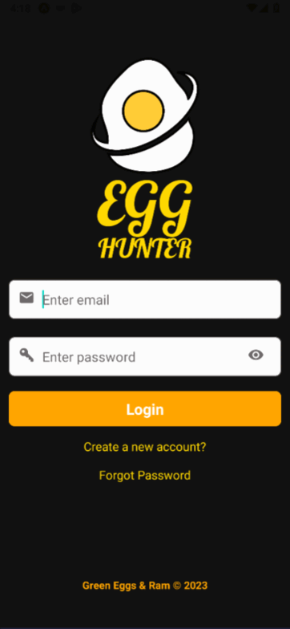

<p align="center">

 </p>

---

- [📱 About the Project](#-about-the-project)
- [💡 Getting Started](#-getting-started)
- [🎮 How it plays](#-how-it-plays)
- [⚙ Technologies](#-technologies)
- [🤝 About the Team](#-about-the-team)
- [❓ FAQ](#-faq)

## 📱 About the Project

<p align ="center">

**Egg Hunter YYC** is a fun, interactive way for users to connect with our
physical city and learn more about our own culture, history and future. The
app also paves the way for the city’s different cultural organizations, as well
as artists, changemakers and truth-tellers from diverse backgrounds, to
share their work, amplifying their voice and impact in our city.

</p>

<p>

**Egg Hunter YYC** is a mobile application which utilizes
a user’s location to orient them towards zones, filled
with virtual “eggs” to discover and unlock. These
caches of information can include audio, visual or even augmented-reality content from local content-
creators. A supporting [**website**](www.egghunter.site) was created to support users learning more about the
application.

</p>

---

## 💡 Getting Started

Run

```
npm run start:app
```

to start the app.

---

## 🎮 How it plays

<p>
These are the cornerstones of our app; users can sign in or create a new account, interact with zones to discover eggs, view or hear new content, or revisit old favorites.
</p>

<kbd></kbd>

<p>
As a geocaching game, the Egghunter app tracks the users movements and allows them to discover and interact with content that is only accessible in specific regions of the city.
Zone and egg geographic coordinates persist in the database, and their content including images, audio and related data are retrieved when their egg is available.

Zone, egg and user information persist in firestore, while media content persists in fire storage.

</p>

---

## ⚙ Technologies

 [](https://expo.io/)

    

<p>
In order to support our aim of building a mobile application, we had to determine the core support products it would require.

Firstly, we decided to use React Native and Expo

- It can be deployed on both iOS and Android platforms, using a single codebase.
- More accessible to compile with the JS language; React Native is similar to React which we used in our last projects.
- Expo is a framework to build RN apps; a bundle of tools and services to make the development process smooth and easy.

Next, we need to decide what type of database would best support our application.

- Considering Firebase because of serverless framework and database scalability. NoSQL document database that can handle large datasets and high traffic, while Firebase Storage can store and serve files of any type or size.
- Firebase also provides strong security features, including secure user authentication, database security rules, which integrates tightly with Firestore and Firebase Storage.
</p>

---

## 🤝 About the Team

<p>

[**Maggie Chew**](https://github.com/maggiechew) - Tech Lead, product manager

[**Vince Iannelli**](https://github.com/vinceiannelli) - Creative Experience Champion

[**Yan Liu**](https://github.com/yanliu1111) - Firebase Maven

[**Greg Richardson**](https://github.com/gregnr) - Scrum Master

</p>

---

## ❓ FAQ

If you have questions about this project and want answers, then check out our [**WEBSITE**](www.egghunter.site) and contact us in Github!
